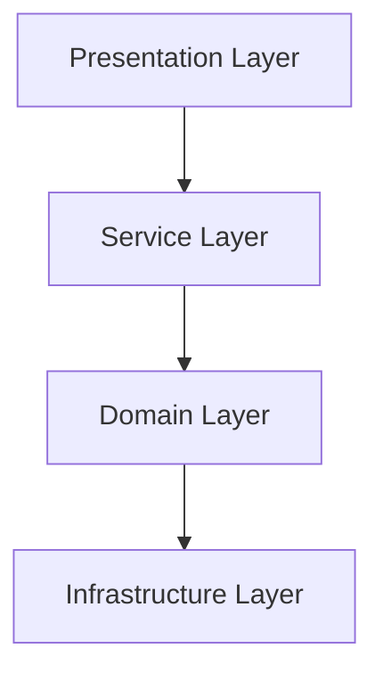
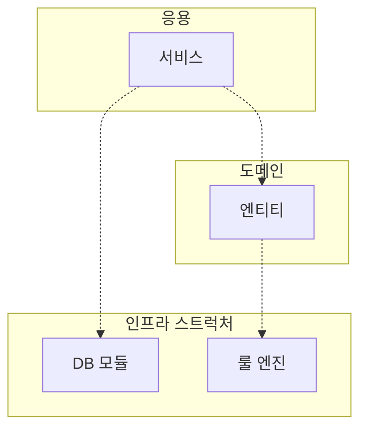
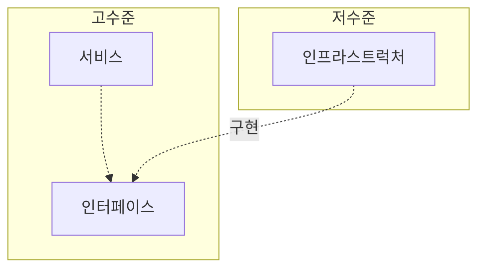

# 📕 도메인 주도 개발 시작하기
- 읽은 기간 : 2026. 01. 19 ~ 
---
# 1. 도메인 모델 시작하기
## 도메인이란?
- 도메인은 소프트웨어로 해결하고자 하는 문제영역을 뜻한다.
	- 개발자 입장에서는 '구현해야 할 소프트웨어의 대상'
- 한 도메인은 다시 하위 도메인으로 나눌 수 있다.
	- 하위 도메인을 어떻게 구성할지 여부는 상황에 따라 다르다.

## 도메인 전문가와 개발자 간 지식 공유
- 코딩에 앞서 요구사항을 올바르게 이해하는 것이 중요하다.
- 요구사항을 제대로 이해하지 않으면 쓸모없거나 유용함이 떨어지는 시스템을 만든다.
	- 오히려 변경/다시 만들기에 일정을 더 쓸 수도 있으므로 주의할 것.
- 도메인 이해도를 높이고, 요구사항을 정확하게 구현하기 위해 **개발자와 전문가가 직접 대화하는 것이 중요**하다.
- ==❓AI 도입 후 도메인 주도 개발의 의의는, 결국 이 '요구사항'과 '유비쿼터스 언어'의 중요성 부각인 것 같다.==

## 도메인 모델
- 기본적으로 특정 도메인을 '개념적'으로 표현한 것.
- 도메인 모델을 객체로만 모델링 할 수 있는 것은 아니다.
	- 상태 다이어그램
	- 클래스 다이어그램
	- 그래프 등등
- ==❓표현 방식은 문서로서 작동할 수 있으면 뭔들?==

> 도메인 모델은 기본적으로 도메인 자체를 이해하기 위한 개념 모델이다. 개념 모델을 이용해서 바로 코드를 작성할 수 있는 것은 아니기에 구현 기술에 맞는 구현 모델은 따로 필요하다. p.029

- ==💡함수형으로 도메인을 표현한 사례도 있었는데, 다른 곳에도 통용되는지는 모르겠음;==
- 하위 도메인과 모델
	- 같은 용어라도 하위 도메인마다 의미가 달라질 수 있다.
	- 도메인에 따라 용어 의미가 결정되므로 여러 하위 도메인을 하나의 다이어그램에 모델링하면 안된다. (혼란이 있으므로)

## 도메인 모델 패턴
- 도메인 모델은 아키텍처 상의 도메인 계층을 객체 지향기법으로 구현하는 패턴을 말한다.
	- 참고: '엔터프라이즈 애플리케이션 아키텍처 패턴' 마틴 파울러
- 도메인 계층은 도메인의 핵심 규칙을 구현한다.
	- **핵심 규칙을 구현한 코드가 도메인 모델에만 위치하기 때문에 규칙이 바뀌거나 규칙을 확장해야 할 때 다른 코드에 영향을 덜 주고 변경 내역을 모델에 반영할 수 있게 된다.** p.33
- 개념모델과 구현 모델
	- 개념 모델 = 순수하게 문제를 분석한 결과물
	- 구현 모델 = 개념 모델을 구현 가능한 형태의 모델로 전환하는 과정을 거침.
	- **처음부터 완벽한 개념 모델을 만들기보다는 전반적인 개요를 알 수 있는 수준으로 개념 모델을 작성해야 한다. 프로젝트 초기에는 개요 수준의 개념 모델로 도메인에 대한 전체 윤곽을 이해하는 데 집중하고, 구현하는 과정에서 개념 모델을 구현 모델로 점진적으로 발전시켜 나가야 한다. p.34**

## 도메인 모델 도출
- 문서화
	- 전반적인 기능 목록이나 모듈 구조, 빌드 과정은 코드를 보고 이해하는 것보다 상위 수준에서 정리한 문서를 참조하는 것이 소프트웨어 전반을 빠르게 이해하는 데 도움이 된다.
	- 도메인 관점에서 코드가 도메인을 잘 표현해야 비로소 코드의 가독성이 높아지고 문서로서 코드가 의미를 갖는다.

## 엔티티와 밸류
- 엔티티
	- 서로 다른 식별자가 있다. 객체마다 고유하다.
	- ==❓ ID를 DB에서 자동생성하는 경우, ID가 있는 도메인과 없는 도메인을 구별해야할까? (DB 저장 전 도메인과 저장 후 도메인) 어떻게 사용하고 계신지 궁금합니다==
		- 엔티티의 생명주기에 관련한 질문인 것같음.
		- DB 자동 생성하는 ID말고 코드상으로 ID를 생성해준다.
		- 파일은 동일하게 사용하고 있음.
- 밸류
	- 개념적으로 완전한 하나를 표현할 때 사용.
	- 두 밸류 객체를 비교할 때는 모든 속성이 같은지를 비교한다.
- 도메인 모델에 set 메서드는 넣지 않기
	- 도메인 객체가 불완전한 상태로 사용되는 것을 막으려면 생성 시점에 필요한 것을 전달해준다.
	- 불변 밸류 타입을 사용해서 set 메서드를 구현하지 않는다.

## 도메인 용어와 유비쿼터스 언어
- 도메인에서 사용하는 용어를 코드에 반영하지 않으면 그 코드는 개발자에게 코드의 의미를 해석해야하는 부담을 준다.
	- 유비쿼터스 언어로 가독성을 높이자.
- 유비쿼터스 언어란, 모든 이해관계자가 같은 용어를 사용하는 것.
	- 소통 과정에서 용어의 모호함을 줄인다.
	- 코드에서 불필요한 해석을 줄일 수 있다.
- 도메인 용어에 알맞는 단어를 찾는 시간을 아까워하지 말자.
- ==💡DDD의 가장 핵심이라 생각==

---
# 2. 아키텍처 개요
- 아키텍처를 설계할 때 출현하는 전형적인 네 가지 영역: 표현, 응용, 도메인, 인프라스트럭처
	- 표현Presentation: 사용자 요청을 해석해서 응용 서비스에 전달
	- 응용Service: 시스템이 사용자에게 제공해야 할 기능을 구현
	- 도메인Domain: 도메인 모델을 구현
	- 인프라스트럭처Infrastructure: 실제 구현. 외부 DB 등과 연결
- 계층 구조 아키텍처

- 계층 구조는 그 특성상 상위 계층에서 하위계층으로의 의존만 존재.
	- 반대 방향은 의존하지 않는다.
- 전형적인 계층구조상의 의존 관계

## DIP
- 이를 해결하기 위함이 바로 DIP: 의존성 역전 원칙
	- 인프라스트럭처에 따라 서비스 구현이 의존하게된다.
	- 인프라스트럭처가 바뀌면 서비스도 바뀌어야함.
- 저수준 모듈이 고수준 모듈에 의존하도록 바꾼다.
- 추상화한 인터페이스를 사용한다.
	- 룰 적용한 클래스는 인터페이스를 상속받아 구현한다.
	- 인터페이스는 대역객체(mock 객체)를 사용해서 테스트를 진행할 수도 있다.
- 주의사항
	- 핵심은 고수준 모듈이 저수준 모듈에 의존하지 않도록 하기 위함.
	- 저수준 모듈에서 인터페이스를 추출하지 않도록 한다.

## 도메인영역의 구성
- 엔티티 Entity
	- 고유한 식별자를 갖는 객체
	- 도메인의 고유한 개념을 표현한다.
	- 데이터를 포함. 데이터와 관련된 기능을 제공.
	- 도메인 기능을 함께 제공. (DB entity 와 구분된 개념으로 사용해야함)
	- 도메인 관점에서 기능을 구현하고, 기능 구현을 캡슐화해서 데이터가 임의로 변경되는 것을 막는다.
- 밸류 Value
	- 고유한 식별자를 갖지 않는 객체. 개념적으로 하나인 값을 표현할 때 사용.
- 애그리거트 Aggregate
	- 엔티티와 밸류 객체를 하나로 묶은 개념.
	- OrderAggregate = Order entity + OrderLine value + Orderer value
	- 도메인이 커질수록 엔티티와 밸류 개수가 많아진다. 모델은 점점 복잡해진다. 도메인 모델에서 전체 구조를 이해하는 데 도움이 되는 것.
	- 애그리거트 루트를 통해서 간접적으로 애그리거트 내의 다른 엔티티나 밸류 객체에 접근한다. -> 애그맅거트를 기준으로 캡슐화
- 리포지터리 Repository
	- 도메인 모델의 영속성을 처리한다.
	- 엔티티 객체를 로딩하거나 저장하는 기능 제공 등
	- 구현을 위한 도메인 모델. 애그리거트 단위로 도메인 객체를 저장하고 조회하는 기능을 정의한다.
- 도메인 서비스 Domain Service
	- 특정 엔티티에 속하지 않은 도메인 로직을 제공한다.
	- 예를 들어, 할인 금액 계산 등.
## 인프라스트럭처 개요
- 구현의 편리함은 DIP 의 장점만큼 중요하므로 트레이드오프를 고려하여 구현하도록한다.

## 모듈 구성
- 패키지 구조

---

# 3. 애그리거트
- 복잡한 도메인을 이해하고 관리하기 쉬운 단위로 만들려면 상위 수준에서 모델을 조망할 수 있는 것이 필요하다. -> 애그리거트 의 역할
- 일관성을 관리하는 기준이 된다.
- 애그리거트에 속한 객체는 유사하거나 동일한 라이프 사이클을 갖는다.
	- 대부분 함께 생성하고 함께 제거
- (글쓴이의 경험에 비추어보면) 다수의 애그리거트가 한 개의 엔티티 객체만 갖는 경우가 많았으며, 두 개 이상의 엔티티로 구성되는 애그리거트는 드물었다. p.102
	- ==?: 한 애그리거트 내에서 ID를 2개 쓰는 경험이 있었는지?==
## 애그리거트 루트
- 애그리거트에 속한 모든 객체가 일관된 상태를 유지하려면, 전체를 관리할 주체가 필요 -> 애그리거트의 루트 엔티티
- 일관성을 유지시켜줘야한다.
- 애그리거트 루트를 통해서만 도메인 로직을 구현하게 만든다.
	- 단순히 필드를 변경하는 set 메서드는 public 으로 만들지 않는다.
	- 밸류 타입은 불변으로 구현한다.
- 애그리거트 루트는 구성요소의 상태 참조한다.
- 애그리거트 루트는 구성요소에게 기능 실행을 위임하기도 한다.
- 트랜잭션 범위는 작을 수록 좋다.
	- 한 개 테이블을 수정하는 것과 세 개의 테이블을 수정하는 것은 성능상 차이가 발생한다.
	- ==스터디 중: 일관성이 깨졌던 경험이 있었음.==
		- 사례 1: Stale Read + Lost Update (MVCC 환경)
		- 사례 2: 락 대기로 인한 중간 상태 노출
		- -> 그래서 나온게 SAGA 패턴
	- ==스터디 중: 트랜잭션을 걸지 말자, 라고 팀 내에서 논의함.==
		- 중간에 뭐가 잘못되었을 때, 롤백하지 않음. 결제만 성공하면 -> 서비스가 돌아가도록함.
- 

> **트랜잭션은 단순한 `BEGIN–COMMIT`이 아니다**
> - 락(lock) 획득 및 유지
> - Undo / Redo 로그 기록
> - MVCC 스냅샷 관리
> - 충돌 감지 및 롤백 대비
> 
> **테이블 수가 늘면 락 범위와 충돌 확률이 증가한다.**
> - 데드락 가능성 증가
> Undo / Redo 로그가 기하급수적으로 늘어난다.
> - DB 트랜잭션은 롤백용 undo log, 장애 복구용 redo log를 기록한다. 트랜잭션이 무거울수록 로그 세트도 증가하고, 디스트 I/O, fsync 비용이 증가한다.
> 
> **MVCC에서 트랜잭션이 길수록 문제가 커진다**
> - Postgresql, MySQL innoDB 기준하여, 긴 트랜잭션은 옛버전을 오래 유지하게 한다.
> - VACUUM 지연, 인덱스 효율 저하 등이 일어난다.
> 
> 자연스럽게 CPU 관점에서도 차이가 난다.

- ==? 그러나 일관성을 유지하려면 트랜잭션을 길게 가지고 싶은 마음도 있지 않을까? 트랜잭션을 짧게 가져가고 매번 보상로직을 추가해주는 것이 더 경제적일까?==
	- 트레이드 오프라고 생각됨.
	- 일종의 기준이 필요하지 않을까?

| 기준                | 트랜잭션/보상로직 |
| ----------------- | --------- |
| 단일 Aggregate인가?   | 트랜잭션 유지   |
| 강한 불변식이 있는가?      | 트랜잭션 유지   |
| 외부 시스템이 포함되는가?    | 트랜잭션 분리   |
| 고트래픽인가?           | 트랜잭션 축소   |
| 장애 복원력이 중요한가?     | 보상/이벤트    |
| 미래에 분리될 가능성이 있는가? | 보상 설계     |
|                   |           |

- 한 트랜잭션에서 한 애그리거트를 수정한다.
- 애그리거트에서 다른 애그리거트를 변경하지 않는다.
	- 자신의 책임 범위를 넘지 않기
- 도메인 이벤트를 사용하여 한 트랜잭션에서 한 개의 애그리거트를 수정하면서도 동기나 비동기로 다른 애그리거트의 상태를 변경하는 코드를 작성할 수 있다.

## 리포지터리와 애그리거트
- 객체의 영속성을 처리하는 리포지터리는 애그리거트 단위로 존재
- 기본으로 애그리거트 저장, 애그리거트 찾기를 제공한다.

## ID를 이용한 애그리거트 참조
- 애그리거트가 다른 애그리거트를 참조할때는 ID를 참조한다.
- 애그리거트를 직접 객체로 참조할때의 문제점
	- 애그리거트의 책임 범위가 흐려진다.
	- 성능과 관련된 고민을 해야한다.
	- 분산 시스템으로 확장하고자 할때, 기존 도메인간 의존도가 높아 어려움이 있다.
- ID로 참조하면 구현 복잡도가 낮아진다.
- ID로 참조시 N+1 조회 문제가 발생할 수 있다.
	- 이런 경우, 조회 전용 쿼리를 사용하면 된다. DAO 조회 메서드에서 조인을 이용해 한번의 쿼리로 필요한 데이터를 로딩
	- 또는 캐시를 적용
	- 또는 조회 전용 저장소를 따로 구성한다.

## 애그리거트 간 집합 연관

## 애그리거트를 팩토리로 사용하기
- 애그리거트가 갖고 있는 데이터를 이용해서 다른 애그리거트를 생성해야한다면, 애그리거트에 팩토리 메서드를 구현하는 것을 고려해보자.
	- ex. Store -> Product
- 혹은 다른 팩토리에 위임하는 방법도 있다.
	- ex. Store -> ProductFactory.create() -> Product

---
# 4. 리포지터리와 모델 구현

---
